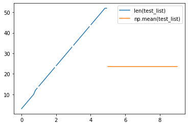
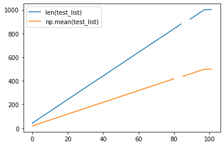
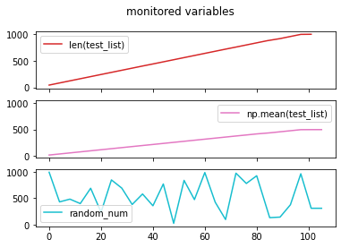

# monitor_resources
Python threat that creates a dict/plot of observations while another code runs

The [monitor_resources.py](https://github.com/ambader/monitor_resources/blob/main/monitor_resources.py) file contains a class that allows to extract and store changing variables during any python code execution. It also provides a pandas table with the result and plots it.

[](https://raw.githubusercontent.com/ugurcandede/Under-Construction/master/under%20building/Capture.PNG)

# Sample

```python
#run the code from monitor_resources.py
```


```python
from threading import Thread
import numpy as np
import pandas as pd
import matplotlib.pyplot as plt
import time

class monitor_resources(Thread):
    def __init__(self,inp_func,time_sleep=1.0):
        Thread.__init__(self)
        self.running = True
        self.inp_func = inp_func
        self.time_sleep = time_sleep
        if time_sleep<1.0:
            self.round_n=10
        else:
            self.round_n=0
        self.out={}
        
    def run(self):
        while self.running:
            time.sleep(self.time_sleep)
            self.out.update({ np.round(time.time(),self.round_n) : eval(self.inp_func)})
            
    def stop(self):
        self.running = False
    
    def get(self):
        return self.out
    
    def pd(self,add_pd=None):
        self.out_pd = pd.DataFrame.from_dict(self.get(), orient='index',columns=[self.inp_func])
        self.out_pd.index = self.out_pd.index-min(self.out_pd.index)
        try:
            self.out_pd = pd.concat([self.out_pd, add_pd ], axis=1)
        except:
            pass
        return self.out_pd
    
    def plot(self):
        return self.pd().plot() 
```


```python
#write a string with the command that monitors and the update-rate in seconds

test1=monitor_resources("len(test_list)",0.1)
test2=monitor_resources("np.mean(test_list)",1)

#start the monitoring

test1.start(),test2.start()

#run the task to monitor

test_list=[1,2]
for i in range(50):
    test_list.append(i)
    time.sleep(0.1)

#stop monitoring

test1.stop()
time.sleep(5)
test2.stop()
```


```python
#plot the results
test1.pd(test2.pd()).plot()
```

    

    


```python
#another example

test1=monitor_resources("len(test_list)",4)
test2=monitor_resources("np.mean(test_list)",4)
test3=monitor_resources("random_num",4)

test1.start(),test2.start(),test3.start()

test_list=[1,2]
for i in range(1000):
    test_list.append(i)
    random_num = np.random.uniform(0,1) * 1000
    time.sleep(0.1)

test1.stop()
time.sleep(5)
test2.stop()
test3.stop()

test1.pd(test2.pd()).plot()
```
    

    


```python
fig, axs = plt.subplots(3, sharex=True, sharey=True)
fig.suptitle('monitored variables')
cc = plt.cm.get_cmap('tab10')([0.3,0.6,0.9])
axs[0].plot(test1.pd(),label=test1.inp_func, color=cc[0])
axs[1].plot(test2.pd(),label=test2.inp_func, color=cc[1])
axs[2].plot(test3.pd(),label=test3.inp_func, color=cc[2])
[s.legend() for s in axs]
```


    

    


```python

```
